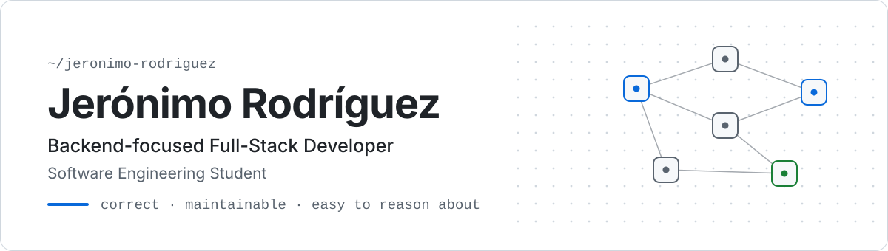
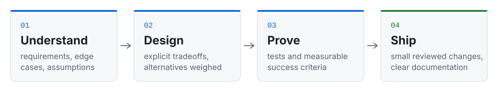

<picture>
  <source media="(prefers-color-scheme: dark)" srcset="assets/header-dark.svg">
  
</picture>

 

I care as much about the **decisions behind the code** as about the code itself: why one approach was chosen, what it trades off, and how we know it works.

I work with AI coding agents with fundamentals first: I define the problem and the architecture, write the tests that encode the requirements, and review every change. The tools accelerate the work; **the engineering judgment stays mine.**

 

## What I work on

<table>
  <tr>
    <td width="33%" valign="top">
      <picture>
        <source media="(prefers-color-scheme: dark)" srcset="assets/icon-backend-dark.svg">
        
      </picture>
      <h3>Backend systems</h3>
      APIs, modular architecture, relational data modeling, authentication and authorization.
    </td>
    <td width="33%" valign="top">
      <picture>
        <source media="(prefers-color-scheme: dark)" srcset="assets/icon-ai-dark.svg">
        
      </picture>
      <h3>AI-assisted engineering</h3>
      Integrating language models into real workflows, and building with AI agents inside a disciplined process.
    </td>
    <td width="33%" valign="top">
      <picture>
        <source media="(prefers-color-scheme: dark)" srcset="assets/icon-product-dark.svg">
        
      </picture>
      <h3>Products for real users</h3>
      Designing, building and shipping software for businesses, from the first conversation to production.
    </td>
  </tr>
</table>

 

## How I work

<picture>
  <source media="(prefers-color-scheme: dark)" srcset="assets/workflow-dark.svg">
  
</picture>

 

  <a href="https://jerodev.com"><b>Portfolio</b></a> &nbsp;·&nbsp;
  <a href="https://linkedin.com/in/jerorodriguez"><b>LinkedIn</b></a> &nbsp;·&nbsp;
  English (B2) / Spanish

